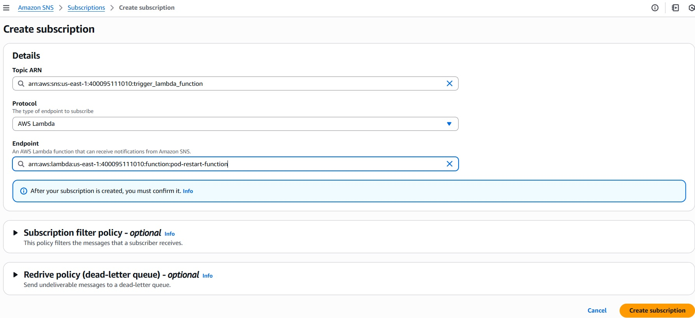

# Restart Pods Automatically using Lambda

## Creating zip file to add Layer to lambda if not exists, here I am already providing ```python.zip``` file

```bash
mkdir python
pip install -t python kubernetes --no-user
# compress package directory
zip -r python
```

## Add Kubernetes layer to Lambda Service

Lambda  --> Layer  --> Create Layer (Add name + upload zip file)


## Create Lambda function

1. Create Policy and Role for Lambda fucntion

```bash
# Create Policy
aws iam create-policy \
  --policy-name lambda-eks-policy \
  --policy-document file://lambda-eks-connection.json

# Create Role
aws iam create-role \
  --role-name lambda-eks-role \
  --assume-role-policy-document file://lambda-trust-policy.json

# Attach Policy to Role
aws iam attach-role-policy \
  --role-name lambda-eks-role \
  --policy-arn arn:aws:iam::400095111010:policy/lambda-eks-policy
```

2. Create lambda function with ```lambda.py``` script attach the above role 


3. Adding Layer to Lambda function


4. Create SNS Topic to trigger Lambda Function


5. Create Subscription to trigger Lambda function



6. Create Custom metric under cloudwatch loggroups using metric filter


7. Select filter pattern


8. Specify details for filter name and metric namespace


9. Review and Create metric


10. Create Alarm to send notifications to SNS


11. Select Custom Namespace under Alarm


12. Select Metric name under Alarm


13. Specify Metric and Conditions


14. Select SNS topic for alarm


15. Review and Create Alarm

